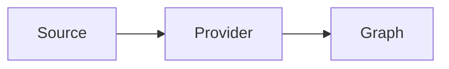

# Rich Markdown Sample

This document is a deterministic source for the **Rich-Markdown provider**
(`kbexplorer-cli#133`). It links to [the platform squad](kg://platform-squad){rel=leads}
and references [the derivation runtime](kg://derivation-runtime). It also points
at an [external spec](https://example.com/spec) and a
[sibling sample](./other-sample.md) by relative path.

Inline code such as `[not a link](kg://ignored)` must be skipped by the link
scanner, and so must fenced code blocks below.

## Architecture



## Graphviz

```dot
digraph G {
  source -> provider -> graph;
}
```

## Calendar

```ics
BEGIN:VEVENT
SUMMARY:Wave 0b review
END:VEVENT
```

## Canvas

```canvas
{ "version": 1, "nodes": [{ "id": "n1", "label": "Source" }], "edges": [] }
```

A plain fenced block in another language is NOT captured as an embedded block:

```bash
echo "ignored"
```
